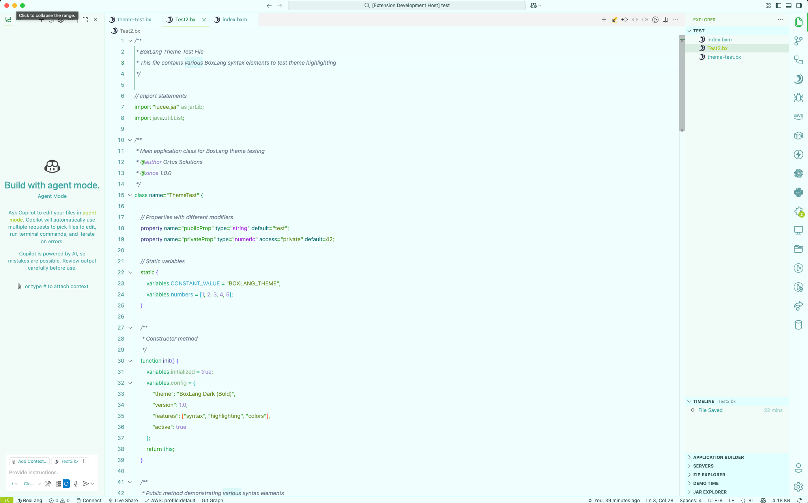

# BoxLang Theme for Visual Studio Code

Clean, modern themes designed specifically for BoxLang development. This extension provides two carefully crafted color schemes that enhance your BoxLang coding experience.

## 🎨 Themes

### BoxLang Dark (Neon)

High-contrast dark theme featuring vibrant neon colors with pink, purple, and cyan accents. Optimized for extended coding sessions while maintaining visual appeal and code readability.

### BoxLang Light (Muted)

Subtle light theme with soft teal and green backgrounds, perfect for daytime development. Features muted accent colors that reduce eye strain during long coding sessions.

## ✨ Features

- **BoxLang Optimized** - Specifically designed for BoxLang syntax highlighting and component recognition
- **Semantic Highlighting** - Enhanced token colors for better code understanding
- **Bracket Pair Colorization** - Distinct colors for matching brackets and parentheses
- **Complete UI Theming** - Consistent colors across editor, sidebar, terminal, and all VS Code interfaces
- **Component Support** - Special highlighting for BoxLang components (`<bx:component>` tags)
- **Eye-friendly** - Carefully selected contrast ratios for comfortable viewing

## 📦 Installation

### From VS Code Marketplace

1. Open VS Code and go to Extensions (`Ctrl+Shift+X` / `Cmd+Shift+X`)
2. Search for "BoxLang Theme"
3. Click **Install**
4. Go to **File → Preferences → Color Theme** and select your preferred BoxLang theme

### Manual Installation

1. Clone this repository
2. Copy the extension folder to your VS Code extensions directory:
   - **Windows:** `%USERPROFILE%\.vscode\extensions`
   - **macOS:** `~/.vscode/extensions`
   - **Linux:** `~/.vscode/extensions`
3. Restart VS Code and select the theme

## 🎯 Recommended Settings

Enable these VS Code settings for the best experience:

```json
{
  "editor.semanticHighlighting.enabled": true,
  "editor.bracketPairColorization.enabled": true,
  "editor.guides.bracketPairs": "active",
  "editor.fontFamily": "Fira Code, 'Cascadia Code', Consolas, 'Courier New'",
  "editor.fontLigatures": true,
  "editor.fontSize": 14,
  "editor.lineHeight": 1.5
}
```

## 📸 Screenshots


*BoxLang Dark (Neon) - High contrast with vibrant accents*


*BoxLang Light (Muted) - Soft colors for comfortable coding*

## 🛠️ Development

### Building and Testing

1. **Clone the repository**

   ```bash
   git clone https://github.com/ortus-boxlang/vscode-boxlang-theme.git
   cd vscode-boxlang-theme
   ```

2. **Install dependencies**

   ```bash
   npm install
   ```

3. **Build themes**

   ```bash
   npm run build
   ```

4. **Test in Extension Development Host**

   ```bash
   npm run dev:host
   ```

### Theme Files

- `themes/boxlang-dark-neon.json` - Dark theme with neon accents
- `themes/boxlang-light.json` - Light theme with muted colors

### Contributing

1. Fork the repository
2. Create a feature branch
3. Edit theme JSON files in the `themes/` directory
4. Run `npm run build` to validate changes
5. Test themes using `npm run dev:host`
6. Submit a pull request with screenshots

**Note:** This repository no longer uses a centralized palette file. Colors are defined directly in each theme JSON file.

## 📝 Issues and Support

- **Report Issues:** [GitHub Issues](https://github.com/ortus-boxlang/vscode-boxlang-theme/issues)
- **Include:** VS Code version, OS, and screenshots when reporting visual issues

## 📄 License

Licensed under the Apache-2.0 License. See [LICENSE](LICENSE) file for details.

## 🔗 Related Extensions

- [BoxLang Language Support](https://marketplace.visualstudio.com/items?itemName=ortus-solutions.vscode-boxlang) - Official BoxLang language extension
- [ColdBox Extension](https://marketplace.visualstudio.com/items?itemName=ortus-solutions.vscode-coldbox) - ColdBox framework support
- [TestBox Extension](https://marketplace.visualstudio.com/items?itemName=ortus-solutions.vscode-testbox) - TestBox testing framework

---

**Made with ❤️ by [Ortus Solutions](https://www.ortussolutions.com) for the BoxLang community.**
